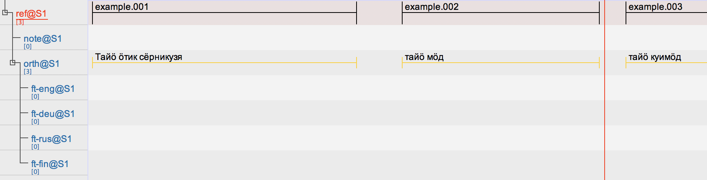
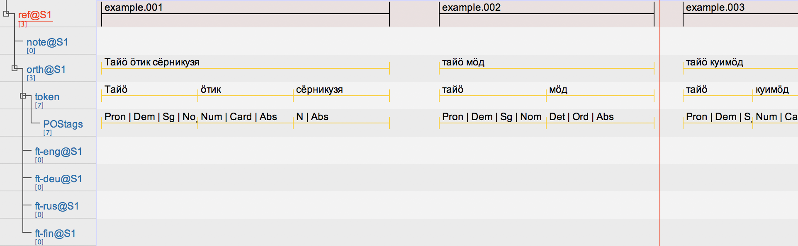

# elan-gt-api

## Introduction

There have been very succesful attempts to use Finite-State-Transducers in Giellatekno infrastructure with transcribed data stored in ELAN. The [Python scripts developed by Ciprian Gerstenberger et. al.](https://github.com/langdoc/elan-fst) within the work on Komi-Zyrian and Saami languages call the locally installed tools and enhance ELAN files with the output of the analyser.

However, there are many situations where using locally installed software is problematic. The tools demand some technical knowledge to be installed and maintained, and some information should regularly move between users and developers. Ideally the software would be updated and critical information about analysers performance would move automatically without involvement of the users themselves, which would also make the use analysers so effortless that the user base could grow.

This project uses Mika Hämäläinen's [uralicNLP](https://github.com/mikahama/uralicNLP) Python package to access [Giellatekno's analysers](http://giellatekno.uit.no/).

## Web applications and ELAN

In ELAN it is nowadays possible to call web applications, principally those within [WebLicht infrastructure](https://weblicht.sfs.uni-tuebingen.de/weblichtwiki/index.php/Main_Page). However, on the background ELAN sends some data as TCF XML file to the web application as a POST request, which returns to ELAN another similarly structured XML file.

Since it is possible to specify in ELAN arbitrary URL for the service, it is easy to run other code and process the data as if it would had been sent to WebLicht.

The goal of this application is to demonstrate how this could be set up, although the current version doesn't work as intended. However, the **idea seems** to work. At the moment the script tries to insert for each word only one lemma and one analysis, as it is bit unclear if the way TCF carries the information allows repeating everything the current [elan-fst script](https://github.com/langdoc/elan-fst) does. There are some things that also probably are governed by how ELAN processes the information when it comes from the web application. Some of the open questions are:

- Can we receive tiers on type symbolic subdivision from the web application
    - This is needed when form has several possible analysis
- Is it possible to control how the new tiers and linguistic types are named

It could also be possible to set up in ELAN Java code a new Giellatekno selection under Options > Web Services menu. Since the language of the tier seems to move between ELAN and Web Service, one could easily send all tiers of specific type (utterance, transcription, text, tokens), and process those onward with the language codes that are in Giellatekno infrastructure.

## Example files

The file `examples/input_from_elan.xml` is formatted as what ELAN sends to the application as a POST request. `examples/output_to_elan.xml` illustrates how the file (apparently) should be formatted in order to be put back into ELAN.

File `demo.py` contains a test application which actually works, although it doesn't really anything, it just sends back to ELAN the kind of file it assumes. So as the example file looks like this:



Then the content that ELAN knows how to work with looks like this:

```
<?xml version="1.0" encoding="UTF-8"?>
<D-Spin xmlns="http://www.dspin.de/data" version="0.4">
<MetaData xmlns="http://www.dspin.de/data/metadata">
<source></source>
<Services>
<CMD xmlns:xsi="http://www.w3.org/2001/XMLSchema-instance" xmlns="http://www.clarin.eu/cmd/" CMDVersion="1.1" 
   xsi:schemaLocation="http://www.clarin.eu/cmd/ http://catalog.clarin.eu/ds/ComponentRegistry/rest/registry/profiles/clarin.eu:cr1:p_1320657629623/xsd">
   <Components>
       <WebServiceToolChain>
          <Toolchain>
               <ToolInChain>
                   <PID>11858/00-1778-0000-0004-BA56-7</PID>
                   <Parameter name="version" value="0.4"></Parameter>
               </ToolInChain>
               </Toolchain>
       </WebServiceToolChain>
   </Components>
</CMD>
</Services>
</MetaData>
<TextCorpus xmlns="http://www.dspin.de/data/textcorpus" lang="de">
<sentences>
<sentence ID="s_0" tokenIDs="t_0 t_1 t_2"></sentence>
<sentence ID="s_1" tokenIDs="t_3 t_4"></sentence>
<sentence ID="s_3" tokenIDs="t_5 t_6"></sentence>
</sentences>
<tokens>
<token ID="t_0">Тайӧ</token>
<token ID="t_1">ӧтик</token>
<token ID="t_2">сёрникузя</token>
<token ID="t_3">тайӧ</token>
<token ID="t_4">мӧд</token>
<token ID="t_5">тайӧ</token>
<token ID="t_6">куймӧд</token>
</tokens>
<POStags tagset="stts">
<tag ID="pt_0" tokenIDs="t_0">sometag1</tag>
<tag ID="pt_1" tokenIDs="t_1">sometag2</tag>
<tag ID="pt_2" tokenIDs="t_2">sometag3</tag>
<tag ID="pt_3" tokenIDs="t_3">sometag4</tag>
<tag ID="pt_4" tokenIDs="t_4">sometag5</tag>
<tag ID="pt_5" tokenIDs="t_5">sometag6</tag>
<tag ID="pt_6" tokenIDs="t_6">sometag7</tag>
</POStags>
</TextCorpus>
</D-Spin>
```

This brings into ELAN following annotations:



## Use

Just run in project folder:

    FLASK_APP=elan_app.py flask run
    FLASK_APP=demo.py flask run

If everything is ok, you should see:

     * Serving Flask app "elan_app"
     * Running on http://127.0.0.1:5000/ (Press CTRL+C to quit)

After this you can point in ELAN's Options > Web Services > WebLicht menu the web service to be called from address `http://127.0.0.1:5000/`. The idea is that the application would also do tokenization, so select a tier containing utterances. Once everything works the URL would be somewhere else, and the user wouldn't need to care about anything.

## Tasks

- It's worth inspecting what happens in ELAN's own code when the input and output are processed
    - A lot is happening i.e. in `src/main/java/mpi/eudico/webserviceclient/weblicht/TCFtoTranscription.java`
- I'm not sure what is happening with tokenization in file that ELAN sends?
- Language tag is apparently somehow transferred to the web service -- how can we access this?

## Authors

- Niko Partanen

## Images

### Web Service selection


### Custom URL for Web Service

